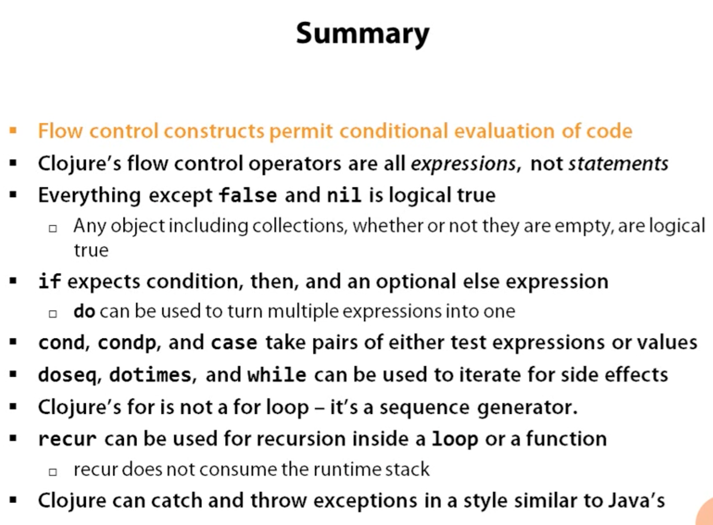
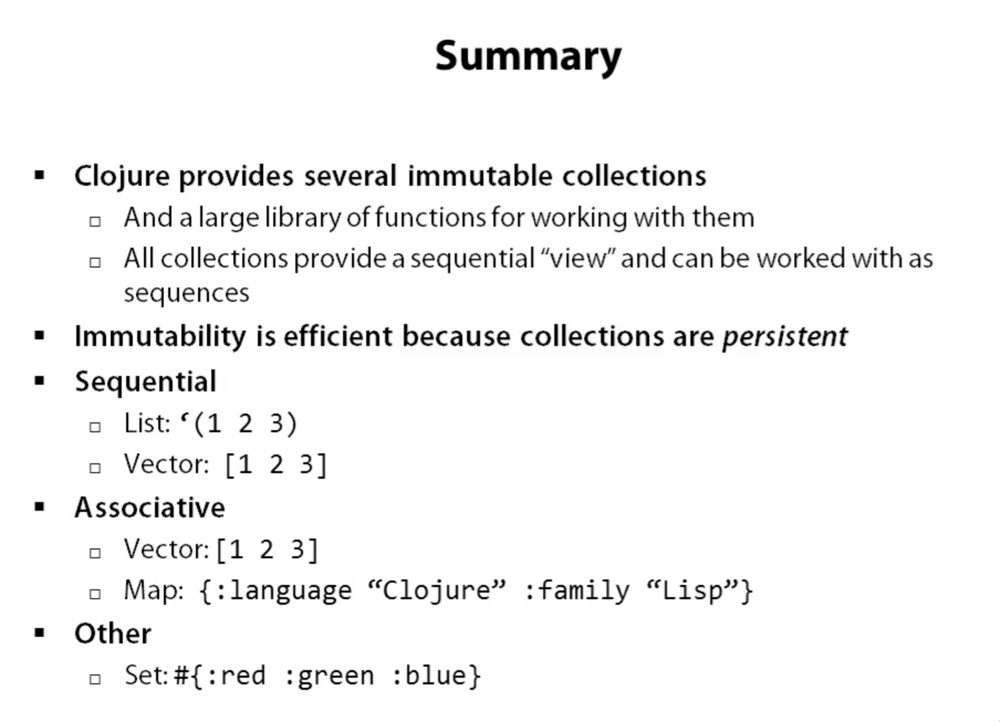
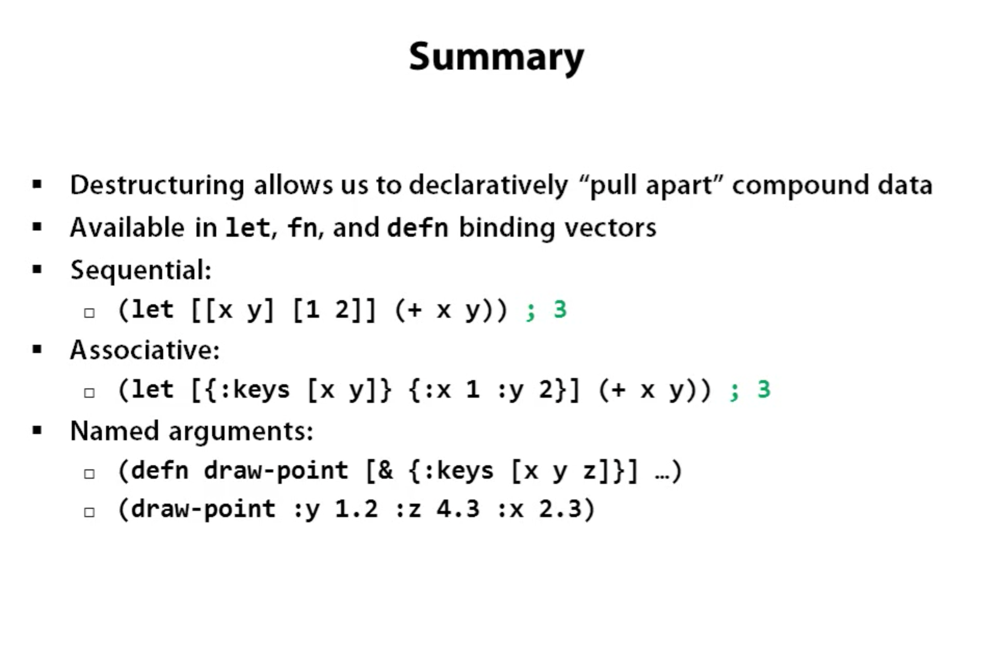

# 1 Introduction

This is a document to help me through a journey to create new stuff with Clojure

## Literals

```clojure
42              ; Long
6.022e23        ; Double

42N             ; BigInt
1.0M            ; BigDecimal
22/7            ; Ratio

"hello"         ; String
\e              ; Character

true false      ; boolean
nil             ; null
+ Fred *bob*    ; Symbols *mutable* also known as mothears
:key :word      ; Keywords

```

## Data structures
```clojure
(4 :key 3.0)      ; List
[2 "string" 99]   ; Vector
{:one 1, :two 2}  ; Map, come is whitespace
{:one 1 :two 2}   ; Map without coma works too
#{unique member}  ; Set
```

## Meta data

```clojure
(with-metadata [1 2 3] {:numbers true})
;; => [1 2 3]
;; 
(meta (with-metadata [1 2 3] {:numbers true}))
;; => {:numbers true}
```

## Reader macros

| Reader Macros   | Expansion                     |
| ---             | ---                           |
| 'foo            | `(quote foo)`                 |
| #'foo           | `(var foo)`                   |
| @foo            | `(deref foo)`                 |
| #(+ % 5)        | `(fn [x] (+ x 5)`             |
| ^{:key val} foo | `(with-meta foo {:key val})`  |
| ^key foo        | `(with-meta foo {:key true})` |
  

## REPL Utilities

``

```clojure
;; First we need to import the clojure.repl
(use clojure.repl)

;;
;; Then we can ask for more documentation
;; 

(doc when)
;; => 
;; -------------------------
;; clojure.core/when
;; ([test & body])
;; Macro
;;  Evaluates test. If logical true, evaluates body in an implicit do.
```

### You could easily ask for
- `(find-doc "sequence")` all that matches sequence
- `(apropos "map)` a list of all the definitions that have map in their name
- `(source take)` see the source code for a function
- `(dir clojure.repl)` prints all available definitions.

## Leiningen directory structure

| Path        | Purpose                   |
| ---         | ---                       |
| project.clj | Project/build config      |
| classes/    | Compiled bytecode         |
| lib/        | Dependent JARs            |
| public/     | HTML/CSS/JS files for web |
| src/        | Clojure source            |
| test/       | Unit tests                |

## Maven directory structure

| Path              | Purpose              |
| ---               | ---                  |
| pom.xml           | Project/build config |
| target/classes    | Compiled bytecode    |
| ~/.m2/repository/ | Dependent JARs       |
| src/main/clojure  | Clojure source       |
| src/test/clojure  | Unit test            |

## Summary
 


# 2 Functions

- are first-class abstration
- can be stored, passed as argument, invoked
- fn creates a function with named parameters and body

## Anonymous Functions
```clojure
;;   params       body
;;  ---------   -------------
(fn [message] (print message)) 
```
- fn makes _anonymous_ functions
- can be invoked the same way as in JS

```clojure
( (fn [message] (print message)) ; Operation
) "Hello world"                  ; Arguments
;; => Hello world!
```
 Here the "Hello world" is passed as an argument to the anonymous function which is then printed as a message

## Naming Functions
```clojure
;; long version 
(def messenger (fn [msg] (print msg)))
;;=> #'user/messenger
;; short version 
(defn messenger [msg] (print msg))
;; invoking the function
(messenger "Hello world!")
;;=> hello world=> nil
```

## Let
- bind symbols to immutable values
- values may be literals or expressions
- bound symbols are available in lexical scope
```clojure
(defn messenger [msg]
  (let [a 7
        b 5
        c (capitalize msg)]
    (println a b c)
  ) ; end of let scope
) ; end of function
```
## Multi-arity functions
- can overload function by arity
  - Arity: number of arguments
- each arity is a list: ([args*] body*)
- one arity can invoke another

```clojure
(defn messenger
  ([] (messenger "Hello World!"))
  ([msg] (print msg)))
;;

(messenger)                       ;;=> Hello world
(messenger "Some other messeage") ;;=> Some other messaage

```

> Think of arity as a way of providing default arguments

## Variatic functions

- Variatic: function of indefinite arguments
  - Only one version of a variatic function is allowed when overloading on arity
- & symbol in params, instructs clojure a variadic is coming
  - next param collects all remaining args (0 or more)
  - colected args represented as sequence
  
```clojure
;; can receive 0 or n of [who] arguments which becomes a list
(defn messenger [greeting & who]                            
  (print greeting who))

(messenger "Hello" "world" "class")
;;=> Hello (world class) 
;; List----^-----------^
```
## Apply
- invokes function on arguments from a sequence
- final argument is a sequence
- "unpacks" remaining arguments from sequence

```clojure
(let [a 1
      b 2
      more `(3 4)]
  (apply messenger a b more))
;; this invokes (messenger 1 2 3 4) => 1 (2 3 4)
```

> To better see the relationship between apply and variadic functions

```clojure
(defn messenger [greeting & who]
  (apply print greeting who) ;; unpacking who
;;
(messenger "Hello" "world" "class")
;;=> Helo world class
```

## Clojures
- fn "closes" over surrounding lexical scope
  - creates a clojure
- closed-over references persist beyond lexical scope

```clojure
(defn messenger-builder [greeting] ; returns an anonymous function
  (fn [who] (print greeting who))) ; which closes over/remebers/captures the greeting symbol

;; greeting provided here, then goes out of scope
(def hello-er (messenger-builder "Hello"))

;; greeting still available because hello-er is a closure
(hello-er "world!")
;;=> Hello world
```

## Invoking Java Code
| Task            | Java              | Clojure          |
|:----------------|:------------------|:-----------------|
| Instatiation    | new Widget("Foo") | (Widget. "foo")  |
| Instance method | rnd.nextInt()     | (.nextInt rnd)   |
| Instance field  | object.field      | (.-field object) |
| Static method   | Math.sqrt(25)     | (Math/sqrt 25)   |
| Static field    | Math.PI           | Math/PI          |

## Chaining access

| Language      | Syntax                             |
|:--------------|:-----------------------------------|
| Java          | person.getAddress().getZipCode()   |
| Clojure       | (.getZipCode (.getAddress person)) |
| Clojure Sugar | (.. person getAddress getZipCode)  |

## Java Method vs Functions
- Java methods are not Clojure functions
- Can't store them, pass them as arguments
- Can wrap them in functions when necessary

```clojure
;; make a function to invoke .length on arg
(fn [obj] (.length obj))
```

## Terse fn reader macro

- Terse form #() short fns defined inline
  - Single argument: %
  - Multiple args: %1, %2, %3, ..
  - Variadic: %& for remaining args
  
```clojure
;; a function to invoke .length on arg
#(.length %)
```


# 3 Names and Namespaces

## Why Namespaces?

- Re-use common name in different contexts
  - eg clojure.core/replace and clojure.string/replace
- Separate application "layers" or "components"
- Libraries
- Separate "public API" and "internal implementation"

## What's in a Namespace?
- Namespace scope
  - Vars
  - Keywords
  - Java type names
- Local, lexical scope
  - function arguments
  - let

## Namespace-Qualified Vars

```clojure
;; In the namespace "foo.bar"
(defn hello [] (println "Hello, World"))

;; In another namespace
(foo.bar/hello) ; namespace-qalified, here we are actually invking the function with no arguments
```

## Namespaced-Qualified Keywords
```clojure
;; In namespace "foo..bar"
:x      ; Keyword with no namespace

::x     ; Keyword with namespace "foo.bar"
        ; ::x in one namespace is different from
        ; ::x in another namespace

:baz/x  ; Keyword with namespace "baz"
        ; here we are fully qulifying the namespace
        ; It's a good idea if you want to avoid collision
```

## Namespaces in the REPL

- `in-ns` switches to namespace
  - Creates namespace if it doesn't exist
- Argument is a symbol, must always be quoted
- REPL always starts in namespace "user"

```clojure
user=> (in-ns 'foo.bar.baz)
;;=> nil
foo.bar.baz =>
```

## Namespace Operations

- Load: find source on classpath & eval it
- Alias: make shorter name for namespace-qualified symbols
- Refer: copy a symbol bindings from another namespace into current namespace
- Import: make Java class names available in current namespace

## `require`

- Loads the namespace if not already load
  - argument is a symbol, must be quoted
- Have to refer to things with fully-qualified names

```clojure
(require 'clojure.set)
;;=> nil

(clojure.set/union #{1 2} #{2 3 4})
;;=> #{1 2 3 4}
```

## `require :as`
- Loads the namespace if not already loaded
  - argument is a vector, must be quoted
- Aliases the namespace to alternate name
(
```clojure
(require `[clojure.set :as set])
;;=> nil

;; "set" is an alias for "clojure.set"
(set/union #{1 2} #{2 3 4})
;;=> #{1 2 3 4}
```

## `use`

- Loads the namespace if not already loaded
  - argument is a symbol, must be quoted
- Referes all symbols into current namespace
- Warns when symbol clash
- Not recommanded exept for REPL exploration

```clojure
user=>(use 'clojure.string)
WARNING: reverse already refers to: 
#'clojure.core/reverse in namespace: 
user, being replaced by: 
#'clojure.string/reverse
=> nil
(reverse "hello")
;;=> "olleh"
```

## `use :only`
- Loads the namespace if not already loaded
  - argument is a vector, must be quoted
- Refers only specified symbols into current namespace

```clojure
(use '[clojure.string :only (join)])
=> nil
(join "," [1 2 3])
=> "1,2,3"
```

## Reloading the Namespaces

- By default, namespaces are loaded only once
- `use` and `require` take optional flags to force reload

```clojure
;; Reload just the foo.bar namespace:
(require 'foo.bar :reload)

;; Reload foo.bar and everything
;; required or used by foo.bar:

(require 'foo.bar :reload-all)
```

## Import

- Makes Java classes available w/o pacage prefix in current namespace
  - argument is a list, quoting is optional
- Does not support aliases/renaming
- Does not support Java's `import *`

```clojure
(import (java.io FileReader File))
;;=> nil

(Filereader. (File. "file.txt"))
;;=> #<FileReader ...>
```

## Namespaces and Files

- For require/use to work, have to find code defining namespace
- Clojure converts namespace name to path and looks on CLASSPATH
  - Dots in namespace name become /
  - Hyphens become underscores
- Idiomatic to define namespace per file

## `ns` Declaration

> One way to think of a namespace is as a DSL (Domain Specific Language) for describe a series of desired, uses and requires in a namespace

- Creates namespace and loads, aliases what you need
  - at top of file
- Refers all of `clojure.core`
- Imports all of `java.lang`

```clojure
;; in file foo/bar/baz_quux.clj
(ns foo.bar.baz-quux)
```

## `ns : require`

- Loads other namespaces with optional alias
  - arguments are -not- quoted

```clojure
(ns my.cool.project
  (:requite [some.ns.foo :as foo]))
    
(foo/function-in-foo)
```

## `ns :use`

- Loads other namespace and refers symbols into namespace
  - arguments are not quoted

```clojure
(ns my.cool.project
  (:use [some.ns.foo :only (coo koo)]))
    
(coo) ;=> (some.ns.foo/coo)
```

## `ns :import`

- Loads Java library and refers symbols into namespace
  - arguments are not quoted
  
```clojure
(ns my.cook.project
  (:import (java.io File Writer)))
  
File    ;=> java.io.File
```
## `ns` Complete Example

```clojure
(ns name
  (:require [some.ns.foo :as foo]
            [other.ns.bar :as bar])
  (:use [this.ns..baz :only (a b c)]
        [that.ns.coo :only (d e f)])
  (:import (java.io File FileWriter)
           (java.net URL URI)))
```

## Private vars

- Add `^:private` metadata to a definition
  - `defn-` is a shortcut for `defn ^:private
- Prevents automatic refer with `use`
- Prevents accidental reference by qualified symbol
- Not truly hidden: can work around

## `the-ns`

- NSs are first class objects
- But their _names_ are not normal symbols

```clojure
clojure.core
;; => ClassNotFoundException: clojure core

(the-ns 'clojure.core)
;;=> #<Namespace clojure.core>

```

## Namespace Introspection

- `ns-name`: namespace name, as symbol
- `ns-map`: map of all symbols
  - `ns-interns`: only def'd Vars
  - `ns-publics`: only public Vars
- `ns-imports`: only impored classes
- `ns-refers`: only Vars from other namespaces
- `ns-aliases`: map of all aliases
- `clojure.repl/dir`: print public Vars


# 4 Flow Control

## Expresions in Clojure

> Expressions return a value, statements don't

- In Clojure there are only expressions
  - always returns a value
  - a block of multiple expressions returns the last value
    > let, do, fn: all return wathever was the value of the last expression inside of them
  - Expressions exclusively for side-effects (network, io) return `nil`
  
## Flow Control Expressions

- Flow control operators are expressions too
- Composable, can use the anywere
  - Fewer intermediate variables
- Extensible, via macors
  > eg: when-let
  
## Truthiness

```clojure
(if true :truthy :falsey)
;;=> :truthy
(if (Object.) :truthy :false)
;;=> :turthy
if( [] :truthy :falsey) ; empty collections are true
;;=> :truthy

(if false :truthy :falsey)
;;=> :falsey
(if nil :truthy :falsey) ; nil is false
;;=> :falsey
(if (seq []) :truthy :falsey) ; seq on empty coll is nil
;;=> :falsey
```

## `if`

```clojure
(str "2 is " (if (even? 2) "even" "odd")))
;;=> "2 is even"

;; else-expression is optional
(if (true? false) "Imposible!!!")
;;=> nil
```

## `if do`

- Multiple expressions per branch
- Last value in branch returned
```clojure
(if (even? 5)
  (do (println "even")
      true)
  (do (println "odd")
      false)) ;=> false
;; odd
```
Here the value false is returned but in the same time the `odd` message is printed out

## `if-let`

- Often want `let` as `if` branch, instead of do
- if-let combines the forms
- Only one binding form allowed, tested for truthiness
```clojure
(if-let [x (even? 3)]
   (println x)
   (println "some odd values"))
```

## `cond`

- Unlinke `if`, `cont` cand take a series of tests
- `:else` expression is optional
```clojure
(cond
  test1 expression1
  test2 expression2
  ...
  :else else-expression)
```
Here's an example:
```clojure
(let [x 11]
  (cond
    (< x 2) "x is smaller than 2"
    (< x 10) "x is smaller than 10")
    :else "x is greater or equal to 10")
;;=> "x is less than 10"

```

## `condp`

- Cond with shared predicate

```clojure
(defn foo [x]
  (condp = x
    5  "x is 5"
    10 "x is 10"
    "x isn't 5 or 10")) ; default expression
(foo 11) ;=> "x isn't 5 or 10"
```

## `case`

- Predicate always =
- Test-values must be compile-time literals
- Match is O(1)
- Else-expression has no test value

```clojure
(defn foo [x]
  (case x
    5 "x is 5"
    10 "x is 10"
    "x isn't 5 or 10"))
(foo 11) ;=> "x inst't 5 or 10"
```

## Recursion and Iteration

- `loop` and the sequence abstration
- `loop` is "classic" recursion
  - closed to consumers, lower-level
- Sequences respresent iteration as values
  - consumers can partially iterate
  
## `doseq`

- Iterates over a sequence
  - similar to java's foreach loop
- If a lazy sequence, `doseq` forces evaluation

```clojure
(doseq [n (range 3)]
  (println n))
;; 0
;; 1
;; 2
;; => nil

```

#### `doseq` multiple bindings

- similar to nested foreach loops
- processes all permutations of sequence content


# Tips, tricks and other gotchas

#### get the keys of a map of all the symbols available in a namespace
```clojure
(keys (ns-publics 'clojure.java.io))
(dir "clojure.java.io")
```

## `dotimes`

```clojure
(dotimes [i 3]
  (println i))
;; 0
;; 1
;; 2
;;=> nil
```

## `while`

- evaluate expression while condition is true

```clojure
(while (.accept socket)
  (handle socket))
```

## `for`

- List comprehension, NOT a for-loop
- Generator function for sequence permutation

```clojure
(for [x [0 1]
      y [0 1]]
  [x y])
;;=> ([0 0] [0 1] [1 0] [1 1]) ; seq
```

## `loop recur`

- Functional looping construct
  - `loop` defines bindings
  - `recur` re-executes `loop` new bindings
- Prefer higher-order libray fns

```clojure
(loop [i 0]
  (if (< i 10)
    (recur (inc 1))
    i)) ;=> 10
```

## `defn recur`

- fn arguments are bindings

The following example will increase whatever the value we provide until it reaches 10 
```clojure
(defn increase [i]
  (if (< i 10)
    (recur (inc i))
    i))
(increase 1) ;=> 10

```

## `recur` for recursion

- `recur` must be in "tail position"
  - the last expression in a branch
- `recur` must provide values for all bound symbols by position
  - loop bindings
  - defn/fn args
- Recurion via `recur` does not consume stack

## Exception handling

- try/catch/finaly
  - as in Java
  
```clojure
(try
  (/2 1)
  (catch ArithmeticException e
    "divide by zero")
  (finaly
    (println "cleanup")))
;; cleanup
;;=> 2
  
```

## Throwing exceptions

```clojure
(try
  (throw (Exception. "something went wrong"))
  (catch Exception e (.getMessage e)))
;;=> "something went wrong"


```

## `with-open`

- JDK7 introduces try-with-resources
- Clojure provides `with-open` for similar purposes

```clojure
(require '[clojure.java.io :as io])
(with-open [f (io/writer "/tmp/new")]
  (.write f "some text"))
```




# Collections

- Collection are immutable
- Are usually used as function arguments that are returning another collection

## Wisdom of the ancients 

- It's better to have 100 functions operate on one data structure than 10 function operate on 10 data structures

## Immutability

- The values of simple types are immutable
  - 4, 0.5, true
- Values of compund data structure are immutable too
  - This is key to concurrency
- The code should never change the values, it should always generate new ones
- Persistent data structures ensure this is efficient in time and space

## Persistent Data Structures

- Old values + modifications
- New values are not full copies
- New values and old values are both available after 'changes'
- Collection maintains its performance guarateees for most operations
- All Clojure data structures are persistent

## Concrete Data structures

- Sequencial
  - List, Vector
- Associative
  - Map, Vector
- Both types support declarative structuring

## List

- Singly-linked list
- Prepend: O(1)
- Lookup: O(1) at head, O(n) anywhere eles
```clojue
()              ;=> the empty list
(1 2 3)         ;=> error because 1 is not a function
(list 1 2 3)    ;=> (1 2 3)
'(1 2 3)        ;=> (1 2 3)
(conj '(2 3) 1) ;=> (1 2 3)

```

## Vectors 

- Indexed, random-access, array-like
- Append, O(1)
- Lookup, O(1)

```clojure
[]              ;=> the empty vector
[1 2 3]         ;=> [1 2 3]
(vector 1 2 3)  ;=> [1 2 3]
(vec '(1 2 3))  ;=> [1 2 3]
(nth [1 2 3] 0) ;=> 1
(conj [1 2] 3)  ;=> [1 2 3]
```

## Maps

- Key => value, hash table, dictionary
- Insert and lookup: O(1)
- Unordered

```clojure
{}                ;=> empty map
{:a 1 :b 2}       ;=> {:a 1 :b 2}
(:a {:a 1 :b 2})  ;=> 1
({})
```

## Nested maps

```clojure
(def jdoe {:name "John Doe", :address {:zip 27705}})

(get-in jdoe [:address :zip]) ;=> 27705

(assoc-in jdoe [:address :zip] 27513)
;;=> {:name "John Doe", :address {:zip 27514}}
(update-in jdoe [:address :zip] inc)
;;=> {:name "John Doe", :address {:zip 27706}}

```

## Sets

- Set of distinct values
- Insert: O(1)
- Member?: O(1)
- Unordered

```clojure
#{}                   ;=> the empty set
#{:a :b}              ;=> #{:a :b}
(#{:a :b} :a)         ;=> :a
(conj #{} :a)         ;=> #{:a}
(contains? #{:a} :a)  ;=> true
```

> `clojure.set` Examples

```clojure
(require '[clojure.set :as set])
(set/uniuon #{:a} #{:b})             ;=> #{:a :b}
(set/difference #{:a :b} #{:a})      ;=> #{:b}
(set/intersection #{:a :b} #{:b :c}) ;=> #{:b}
```



# Destructuring

- Declarative way to pull apart compund data
  - vs. explicit, verbose access
- Works for both sequential and associative data structures
- Nests for deep, arbitrary access
- Works in `fn` and `defn` params, `let` binding
  - anything built on top of them
  
## Sequencial Destructuring

- Provide vector of symbols to bind by postion
  - Binds to `nil` if there's no data
  
```clojure
(def stuff [7 8 9 10 11]) ;=> #'user/stuff
;; Bind a, b, c to first 3 values in stuff
(let [[a b c] stuff]
  (list (+ a b) (+ b c)))
;;=> (15 17)
(let [[a b c d e f] stuff]
  (list d e f))
;;=> (10 11 nil)
```
- Can get "everything else" with `&`
  - Value is a sequence
  
```clojure
(def stuff [7 8 9 10 11]) ;=> #'user/stuff
(let [[a & others] stuff]
  (println a)
  (println others))
;; 7
;; (8 9 10 11)
;;=> nil
```

> Values you don't care about
- Idiomatic to use `_` for values you dan't care about

```clojure
(def stuff [7 8 9 10 11]) ;=> #'user/stuff
(let [[_ _ & others] stuff]
  (println others))
;; (9 10 11)
```

> Other example

```clojure
(def fruits ["Bananna" "Apple" "Orange"])
;;=> #'user/fruits
(let [[first-fruit] fruits] first-fruit)
;;=> "Bananna"
(let [[_ & favourites]fruits] favourites)
;;=> ("Apple" "Orange")
(defn favourites-fruites [[_ & favourites-fruites]]
  favourites-fruites)
;;=> #'user/favourites-fruites
(favourites-fruites fruits)
;;=> ("Apple" "Orange")
```

## Associative Destructuring

- Provide map of symbols to bind by key
  - binds to `nil` if there's no value
  
```clojure
(def m {:a 7 :b4}) ;=> #'user/m
(let [{a :a, b :b} m]
  [a b])
;=> [7 4] 
```
- Keys can be inferred from vector of symbols to bind

```clojure
(def m {:a 7 :b4}) ;=> #'user/m
(let [{:keys [a b c]} m]
  [a b c])
;;=> [7 4 nil]
```
- Use `:or` to provide default values for bound keys
```clojure
(def m {:a 7 :b4}) ;=> #'user/m
(let [{:keys [a b c]
       :or {c 3}} m]
  [a b c])
;;=> [7 4 3]
```

## Named Arguments

- Applying vector of keys to `&` binding emulates named args

```clojure
(defn game [planet & {:keys [human-players computer-players]}]
  (println "Total players: " (+ human-players computer-players)))
  
(game "Mars" :human-players 1 :computer-players 2)

```
> When a function takes named arguments you don't care about the order

