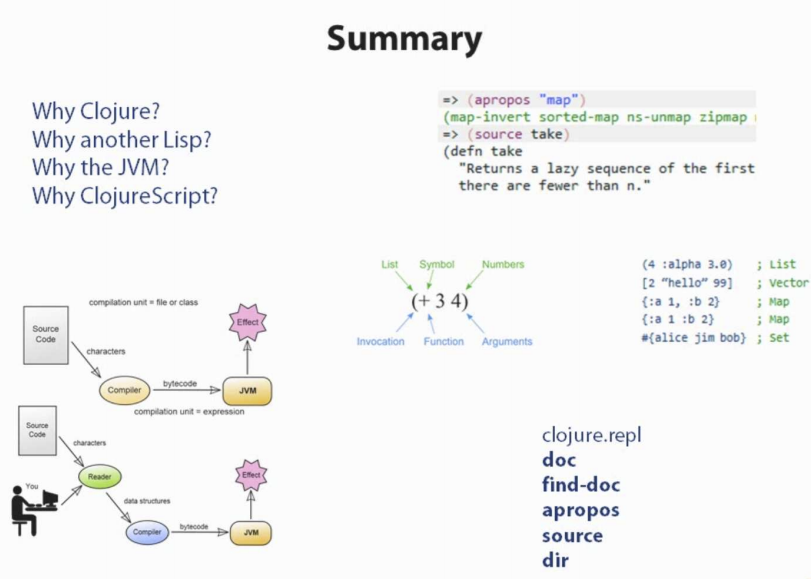
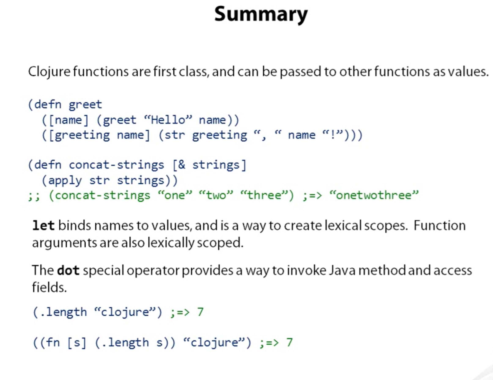
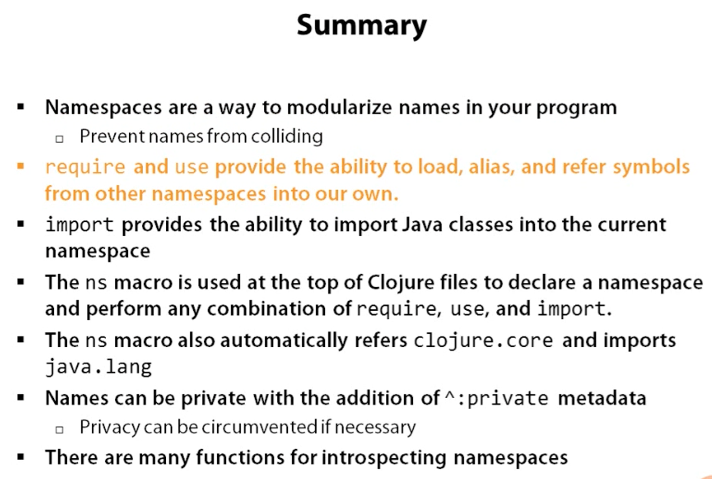

# 1 Introduction

This is a document to help me through a journey to create new stuff with Clojure

## Literals

```clojure
42              ; Long
6.022e23        ; Double

42N             ; BigInt
1.0M            ; BigDecimal
22/7            ; Ratio

"hello"         ; String
\e              ; Character

true false      ; boolean
nil             ; null
+ Fred *bob*    ; Symbols *mutable* also known as mothears
:key :word      ; Keywords

```

## Data structures
```clojure
(4 :key 3.0)      ; List
[2 "string" 99]   ; Vector
{:one 1, :two 2}  ; Map, come is whitespace
{:one 1 :two 2}   ; Map without coma works too
#{unique member}  ; Set
```

## Meta data

```clojure
(with-metadata [1 2 3] {:numbers true})
;; => [1 2 3]
;; 
(meta (with-metadata [1 2 3] {:numbers true}))
;; => {:numbers true}
```

## Reader macros

| Reader Macros   | Expansion                     |
| ---             | ---                           |
| 'foo            | `(quote foo)`                 |
| #'foo           | `(var foo)`                   |
| @foo            | `(deref foo)`                 |
| #(+ % 5)        | `(fn [x] (+ x 5)`             |
| ^{:key val} foo | `(with-meta foo {:key val})`  |
| ^key foo        | `(with-meta foo {:key true})` |
  

## REPL Utilities

``

```clojure
;; First we need to import the clojure.repl
(use clojure.repl)

;;
;; Then we can ask for more documentation
;; 

(doc when)
;; => 
;; -------------------------
;; clojure.core/when
;; ([test & body])
;; Macro
;;  Evaluates test. If logical true, evaluates body in an implicit do.
```

### You could easily ask for
- `(find-doc "sequence")` all that matches sequence
- `(apropos "map)` a list of all the definitions that have map in their name
- `(source take)` see the source code for a function
- `(dir clojure.repl)` prints all available definitions.

## Leiningen directory structure

| Path        | Purpose                   |
| ---         | ---                       |
| project.clj | Project/build config      |
| classes/    | Compiled bytecode         |
| lib/        | Dependent JARs            |
| public/     | HTML/CSS/JS files for web |
| src/        | Clojure source            |
| test/       | Unit tests                |

## Maven directory structure

| Path              | Purpose              |
| ---               | ---                  |
| pom.xml           | Project/build config |
| target/classes    | Compiled bytecode    |
| ~/.m2/repository/ | Dependent JARs       |
| src/main/clojure  | Clojure source       |
| src/test/clojure  | Unit test            |

## Summary
 


# 2 Functions

- are first-class abstration
- can be stored, passed as argument, invoked
- fn creates a function with named parameters and body

## Anonymous Functions
```clojure
;;   params       body
;;  ---------   -------------
(fn [message] (print message)) 
```
- fn makes _anonymous_ functions
- can be invoked the same way as in JS

```clojure
( (fn [message] (print message)) ; Operation
) "Hello world"                  ; Arguments
;; => Hello world!
```
 Here the "Hello world" is passed as an argument to the anonymous function which is then printed as a message

## Naming Functions
```clojure
;; long version 
(def messenger (fn [msg] (print msg)))
;;=> #'user/messenger
;; short version 
(defn messenger [msg] (print msg))
;; invoking the function
(messenger "Hello world!")
;;=> hello world=> nil
```

## Let
- bind symbols to immutable values
- values may be literals or expressions
- bound symbols are available in lexical scope
```clojure
(defn messenger [msg]
  (let [a 7
        b 5
        c (capitalize msg)]
    (println a b c)
  ) ; end of let scope
) ; end of function
```
## Multi-arity functions
- can overload function by arity
  - Arity: number of arguments
- each arity is a list: ([args*] body*)
- one arity can invoke another

```clojure
(defn messenger
  ([] (messenger "Hello World!"))
  ([msg] (print msg)))
;;

(messenger)                       ;;=> Hello world
(messenger "Some other messeage") ;;=> Some other messaage

```

> Think of arity as a way of providing default arguments

## Variatic functions

- Variatic: function of indefinite arguments
  - Only one version of a variatic function is allowed when overloading on arity
- & symbol in params, instructs clojure a variadic is coming
  - next param collects all remaining args (0 or more)
  - colected args represented as sequence
  
```clojure
;; can receive 0 or n of [who] arguments which becomes a list
(defn messenger [greeting & who]                            
  (print greeting who))

(messenger "Hello" "world" "class")
;;=> Hello (world class) 
;; List----^-----------^
```
## Apply
- invokes function on arguments from a sequence
- final argument is a sequence
- "unpacks" remaining arguments from sequence

```clojure
(let [a 1
      b 2
      more `(3 4)]
  (apply messenger a b more))
;; this invokes (messenger 1 2 3 4) => 1 (2 3 4)
```

> To better see the relationship between apply and variadic functions

```clojure
(defn messenger [greeting & who]
  (apply print greeting who) ;; unpacking who
;;
(messenger "Hello" "world" "class")
;;=> Helo world class
```

## Clojures
- fn "closes" over surrounding lexical scope
  - creates a clojure
- closed-over references persist beyond lexical scope

```clojure
(defn messenger-builder [greeting] ; returns an anonymous function
  (fn [who] (print greeting who))) ; which closes over/remebers/captures the greeting symbol

;; greeting provided here, then goes out of scope
(def hello-er (messenger-builder "Hello"))

;; greeting still available because hello-er is a closure
(hello-er "world!")
;;=> Hello world
```

## Invoking Java Code
| Task            | Java              | Clojure          |
|:----------------|:------------------|:-----------------|
| Instatiation    | new Widget("Foo") | (Widget. "foo")  |
| Instance method | rnd.nextInt()     | (.nextInt rnd)   |
| Instance field  | object.field      | (.-field object) |
| Static method   | Math.sqrt(25)     | (Math/sqrt 25)   |
| Static field    | Math.PI           | Math/PI          |

## Chaining access

| Language      | Syntax                             |
|:--------------|:-----------------------------------|
| Java          | person.getAddress().getZipCode()   |
| Clojure       | (.getZipCode (.getAddress person)) |
| Clojure Sugar | (.. person getAddress getZipCode)  |

## Java Method vs Functions
- Java methods are not Clojure functions
- Can't store them, pass them as arguments
- Can wrap them in functions when necessary

```clojure
;; make a function to invoke .length on arg
(fn [obj] (.length obj))
```

## Terse fn reader macro

- Terse form #() short fns defined inline
  - Single argument: %
  - Multiple args: %1, %2, %3, ..
  - Variadic: %& for remaining args
  
```clojure
;; a function to invoke .length on arg
#(.length %)
```



# 3 Names and Namespaces

## Why Namespaces?

- Re-use common name in different contexts
  - eg clojure.core/replace and clojure.string/replace
- Separate application "layers" or "components"
- Libraries
- Separate "public API" and "internal implementation"

## What's in a Namespace?
- Namespace scope
  - Vars
  - Keywords
  - Java type names
- Local, lexical scope
  - function arguments
  - let

## Namespace-Qualified Vars

```clojure
;; In the namespace "foo.bar"
(defn hello [] (println "Hello, World"))

;; In another namespace
(foo.bar/hello) ; namespace-qalified, here we are actually invking the function with no arguments
```

## Namespaced-Qualified Keywords

;; In namespace "foo..bar"
:x      ; Keyword with no namespace

::x     ; Keyword with namespace "foo.bar"
        ; ::x in one namespace is different from
        ; ::x in another namespace

:baz/x  ; Keyword with namespace "baz"
        ; here we are fully qulifying the namespace
        ; It's a good idea if you want to avoid collision

## Namespaces in the REPL

- `in-ns` switches to namespace
  - Creates namespace if it doesn't exist
- Argument is a symbol, must always be quoted
- REPL always starts in namespace "user"

```clojure
user=> (in-ns 'foo.bar.baz)
;;=> nil
foo.bar.baz =>
```

## Namespace Operations

- Load: find source on classpath & eval it
- Alias: make shorter name for namespace-qualified symbols
- Refer: copy a symbol bindings from another namespace into current namespace
- Import: make Java class names available in current namespace

## `require`

- Loads the namespace if not already load
  - argument is a symbol, must be quoted
- Have to refer to things with fully-qualified names

```clojure
(require 'clojure.set)
;;=> nil

(clojure.set/union #{1 2} #{2 3 4})
;;=> #{1 2 3 4}
```

## `require :as`
- Loads the namespace if not already loaded
  - argument is a vector, must be quoted
- Aliases the namespace to alternate name
(
```clojure
(require `[clojure.set :as set])
;;=> nil

;; "set" is an alias for "clojure.set"
(set/union #{1 2} #{2 3 4})
;;=> #{1 2 3 4}
```

## `use`

- Loads the namespace if not already loaded
  - argument is a symbol, must be quoted
- Referes all symbols into current namespace
- Warns when symbol clash
- Not recommanded exept for REPL exploration

```clojure
user=>(use 'clojure.string)
WARNING: reverse already refers to: 
#'clojure.core/reverse in namespace: 
user, being replaced by: 
#'clojure.string/reverse
=> nil
(reverse "hello")
;;=> "olleh"
```

## `use :only`
- Loads the namespace if not already loaded
  - argument is a vector, must be quoted
- Refers only specified symbols into current namespace

```clojure
(use '[clojure.string :only (join)])
=> nil
(join "," [1 2 3])
=> "1,2,3"
```

## Reloading the Namespaces

- By default, namespaces are loaded only once
- `use` and `require` take optional flags to force reload

```clojure
;; Reload just the foo.bar namespace:
(require 'foo.bar :reload)

;; Reload foo.bar and everything
;; required or used by foo.bar:

(require 'foo.bar :reload-all)
```

## Import

- Makes Java classes available w/o pacage prefix in current namespace
  - argument is a list, quoting is optional
- Does not support aliases/renaming
- Does not support Java's `import *`

```clojure
(import (java.io FileReader File))
;;=> nil

(Filereader. (File. "file.txt"))
;;=> #<FileReader ...>
```

## Namespaces and Files

- For require/use to work, have to find code defining namespace
- Clojure converts namespace name to path and looks on CLASSPATH
  - Dots in namespace name become /
  - Hyphens become underscores
- Idiomatic to define namespace per file

## `ns` Declaration

> One way to think of a namespace is as a DSL (Domain Specific Language) for describe a series of desired, uses and requires in a namespace

- Creates namespace and loads, aliases what you need
  - at top of file
- Refers all of `clojure.core`
- Imports all of `java.lang`

```clojure
;; in file foo/bar/baz_quux.clj
(ns foo.bar.baz-quux)
```

## `ns : require`

- Loads other namespaces with optional alias
  - arguments are -not- quoted

```clojure
(ns my.cool.project
  (:requite [some.ns.foo :as foo]))
    
(foo/function-in-foo)
```

## `ns :use`

- Loads other namespace and refers symbols into namespace
  - arguments are not quoted

```clojure
(ns my.cool.project
  (:use [some.ns.foo :only (coo koo)]))
    
(coo) ;=> (some.ns.foo/coo)
```

## `ns :import`

- Loads Java library and refers symbols into namespace
  - arguments are not quoted
  
```clojure
(ns my.cook.project
  (:import (java.io File Writer)))
  
File    ;=> java.io.File
```
## `ns` Complete Example

```clojure
(ns name
  (:require [some.ns.foo :as foo]
            [other.ns.bar :as bar])
  (:use [this.ns..baz :only (a b c)]
        [that.ns.coo :only (d e f)])
  (:import (java.io File FileWriter)
           (java.net URL URI)))
```

## Private vars

- Add `^:private` metadata to a definition
  - `defn-` is a shortcut for `defn ^:private
- Prevents automatic refer with `use`
- Prevents accidental reference by qualified symbol
- Not truly hidden: can work around

## `the-ns`

- NSs are first class objects
- But their _names_ are not normal symbols

```clojure
clojure.core
;; => ClassNotFoundException: clojure core

(the-ns 'clojure.core)
;;=> #<Namespace clojure.core>

```

## Namespace Introspection

- `ns-name`: namespace name, as symbol
- `ns-map`: map of all symbols
  - `ns-interns`: only def'd Vars
  - `ns-publics`: only public Vars
- `ns-imports`: only impored classes
- `ns-refers`: only Vars from other namespaces
- `ns-aliases`: map of all aliases
- `clojure.repl/dir`: print public Vars




# Tips, tricks and other gotchas

#### get the keys of a map of all the symbols available in a namespace
```clojure
(keys (ns-publics 'clojure.java.io))
(dir "clojure.java.io")
```